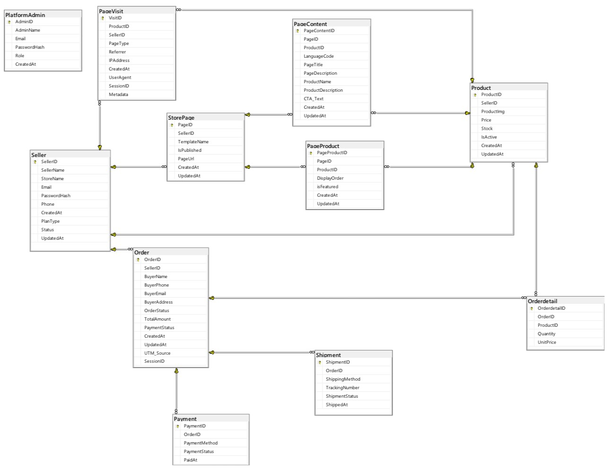

# oneshop
## 資料庫關聯圖 (Database Schema)

## API規格書
👉 [點此查看路由清單](./API_LIST.md)

#### 技術開發規範
1. 命名規範：全專案 API 欄位強制對齊資料庫大寫命名（例：SellerID, ProductID）。
2. 多語系支援：所有查詢 API 均支援 ?lang= 參數切換語系（預設為 zh-TW）。
3. 資料格式：金額採 decimal(12,2)，電話採 E.164 國際標準（例：+886...）。
4. 狀態代碼：統一使用數值（0, 1, 2...），具體含義見各模組說明。
- IsPublished、IsActive、isFeatured 使用位元值（0/1）
- PlanType：0=免費；1=進階付費
- Seller.Status：0=審核中；1=營運中；2=停權；3=已關閉
- OrderStatus：0=處理中；1=待出貨；2=已出貨；3=已送達；4=完成取貨；5=已取消訂單
- PaymentStatus：0=未付款；1=已付款；2=退款中；3=已退款；4=失敗
- ShipmentStatus：0=處理中；1=待出貨；2=已出貨；3=已送達；4=完成取貨；5=已取消
- BuyerPhone 需採 E.164 標準格式（例：+886912345678）
- Price、TotalAmount、UnitPrice 為小數（兩位）
- IsExclusive：0=可與其他優惠券並用；1=不可與其他優惠券並用
- MinSpend、TotalQuantity、UsageLimit：未填或無限制時為 null

### Auth 模組（賣家帳戶）
登入
- Method: POST
- Endpoint: /api/auth/login
- Query Parameters: 無
- Response JSON 範例
```json
{
  "SellerID": 123,
  "SellerName": "ACME",
  "StoreName": "ACME Store",
  "Email": "owner@acme.com",
  "PlanType": 1,
  "Status": 1,
  "AccessToken": "JWT_TOKEN"
}
```
 - 狀態代碼說明
   - PlanType：0=免費；1=進階付費(未來優化空間)
   - Status：0=審核中；1=營運中；2=停權；3=已關閉

- Method: GET
- Endpoint: /api/auth/me
- Query Parameters: 無
- Response JSON 範例
```json
{
  "SellerID": 123,
  "SellerName": "ACME",
  "StoreName": "ACME Store",
  "Email": "owner@acme.com",
  "Phone": "+886912345678",
  "PlanType": 1,
  "Status": 1
}
```

 - 狀態代碼說明
   - OrderStatus：0=處理中；1=待出貨；2=已出貨；3=已送達；4=完成取貨；5=已取消訂單
   - PaymentStatus：0=未付款；1=已付款；2=退款中；3=已退款；4=失敗

 - 狀態代碼說明
   - PlanType：0=免費；1=進階付費
   - Status：0=審核中；1=營運中；2=停權；3=已關閉

登出
- Method: POST
- Endpoint: /api/auth/logout
- Query Parameters: 無
- Response JSON 範例
```json
{ "Success": true }
```

### Store 模組（頁面佈置）
查詢賣家所有頁面（含語系摘要）
- Method: GET
- Endpoint: /api/store/pages
- Query Parameters: SellerID, IsPublished（0/1）, lang（例如 zh-TW）
- Response JSON 範例
```json
[
  {
    "PageID": 1,
    "SellerID": 123,
    "TemplateName": "OnePageV1",
    "IsPublished": 1,
    "PageUrl": "acme",
    "StoreEmail": "",
    "StorePhone": "",
    "StoreBankAccount": "812-1234567890",
    "CreatedAt": "2026-03-02",
    "UpdatedAt": "2026-03-02",
    "PageContent": {
      "LanguageCode": "zh-TW",
      "PageTitle": "ACME 一頁購物",
      "PageDescription": "精選商品與限時優惠",
      "CTA_Text": "立即下單"
    },
    "PageProducts": [
      {
        "PageProductID": 9001,
        "PageID": 1,
        "ProductID": 2001,
        "DisplayOrder": 1,
        "isFeatured": 1,
        "CreatedAt": "2026-03-02",
        "UpdatedAt": "2026-03-02"
      }
    ]
  }
]
```

 - 狀態代碼說明
   - IsPublished：0=草稿；1=已發布

取得單一頁面（依語系回傳內容）
- Method: GET
- Endpoint: /api/store/pages/{PageID}
- Query Parameters: lang（例如 zh-TW）
- Response JSON 範例
```json
{
  "PageID": 1,
  "SellerID": 123,
  "TemplateName": "OnePageV1",
  "IsPublished": 1,
  "PageUrl": "acme",
  "StoreEmail": "",
  "StorePhone": "",
  "StoreBankAccount": "812-1234567890",
  "CreatedAt": "2026-03-02",
  "UpdatedAt": "2026-03-02",
  "PageContent": {
    "PageContentID": 501,
    "PageID": 1,
    "LanguageCode": "zh-TW",
    "PageTitle": "ACME 一頁購物",
    "PageDescription": "精選商品與限時優惠",
    "CTA_Text": "立即下單"
  },
  "PageProducts": [
    {
      "PageProductID": 9001,
      "PageID": 1,
      "ProductID": 2001,
      "DisplayOrder": 1,
      "isFeatured": 1,
      "CreatedAt": "2026-03-02",
      "UpdatedAt": "2026-03-02"
    }
  ]
}
```

 - 狀態代碼說明
   - IsPublished：0=草稿；1=已發布
   - isFeatured：0=否；1=是

### Product 模組（商品與多語系）
查詢商品列表（可依頁面與上架狀態，支援語系）
- Method: GET
- Endpoint: /api/products
- Query Parameters: SellerID, PageID, IsActive, lang
- Response JSON 範例
```json
[
  {
    "ProductID": 2001,
    "SellerID": 123,
    "ProductImg": "https://cdn.example.com/p/2001.png",
    "Price": 1990.00,
    "Stock": 50,
    "IsActive": 1,
    "LanguageCode": "zh-TW",
    "ProductName": "ACME 經典組合",
    "ProductDescription": "人氣暢銷，限時優惠"
  }
]
```

 - 狀態代碼說明
   - IsActive：0=下架；1=上架中

取得單一商品（依語系回傳名稱與描述）
- Method: GET
- Endpoint: /api/products/{ProductID}
- Query Parameters: lang
- Response JSON 範例
```json
{
  "ProductID": 2001,
  "SellerID": 123,
  "ProductImg": "https://cdn.example.com/p/2001.png",
  "Price": 1990.00,
  "Stock": 50,
  "IsActive": 1,
  "LanguageCode": "zh-TW",
  "ProductName": "ACME 經典組合",
  "ProductDescription": "人氣暢銷，限時優惠"
}
```

 - 狀態代碼說明
   - IsActive：0=下架；1=上架中

### Order 模組（交易訂單）
建立訂單（單頁結帳流程）
- Method: POST
- Endpoint: /api/orders
- Query Parameters: 無
- Response JSON 範例
```json
{
  "OrderID": 70001,
  "SellerID": 123,
  "CouponID": 1,
  "CouponCode": "SAVE2026",
  "DiscountValue": "100.00",
  "BuyerName": "王小明",
  "BuyerPhone": "+886912345678",
  "BuyerEmail": "buyer@example.com",
  "BuyerAddress": "台北市中正區 XX 路 1 號",
  "OrderStatus": 0,
  "PaymentStatus": 0,
  "InvoiceType": "member",
  "CarrierCode": "ACME123456",
  "TotalAmount": 1990.00,
  "Items": [
    {
      "OrderdetailID": 1,
      "OrderID": 70001,
      "ProductID": 2001,
      "Quantity": 1,
      "UnitPrice": 1990.00
    }
  ]
}
```

 - 狀態代碼說明
   - OrderStatus：0=處理中；1=待出貨；2=已出貨；3=已送達；4=完成取貨；5=已取消訂單
   - PaymentStatus：0=未付款；1=已付款；2=退款中；3=已退款；4=失敗
   - InvoiceType：member=會員載具；barcode=手機條碼
   - CarrierCode：手機條碼字串（當 InvoiceType 為 barcode 時填寫，格式為 / 開頭共 8 碼）
 - 欄位備註
   - Quantity 必須大於 0
   - TotalAmount、UnitPrice 為 decimal(12,2)

查詢訂單詳情（含物流與付款摘要）
- Method: GET
- Endpoint: /api/orders/{OrderID}
- Query Parameters: 無
- Response JSON 範例
```json
{
  "OrderID": 70001,
  "SellerID": 123,
  "BuyerName": "王小明",
  "OrderStatus": 0,
  "PaymentStatus": 0,
  "TotalAmount": 1990.00,
  "Shipment": {
    "ShipmentID": 3001,
    "OrderID": 70001,
    "ShippingMethod": "HomeDelivery",
    "TrackingNumber": "ACME123456",
    "ShipmentStatus": 0,
    "ShippedAt": "2026-03-01T10:00:00Z"
  },
  "Payment": {
    "PaymentID": 4001,
    "OrderID": 70001,
    "PaymentMethod": "CreditCard",
    "PaymentStatus": 0
  },
  "Items": [
    {
      "OrderdetailID": 1,
      "OrderID": 70001,
      "ProductID": 2001,
      "Quantity": 1,
      "UnitPrice": 1990.00
    }
  ]
}
```

 - 狀態代碼說明
   - OrderStatus：0=處理中；1=待出貨；2=已出貨；3=已送達；4=完成取貨；5=已取消訂單
   - PaymentStatus：0=未付款；1=已付款；2=退款中；3=已退款；4=失敗
   - ShipmentStatus：0=處理中；1=待出貨；2=已出貨；3=已送達；4=完成取貨；5=已取消
 - 欄位備註
  - TrackingNumber 不可為 null
   - ShippedAt 為 ISO8601 時間

查詢訂單列表（賣家後台）
- Method: GET
- Endpoint: /api/orders
- Query Parameters: SellerID, OrderStatus, PaymentStatus
- Response JSON 範例
```json
[
  {
    "OrderID": 70001,
    "SellerID": 123,
    "OrderStatus": 0,
    "PaymentStatus": 0,
    "TotalAmount": 1990.00
  }
]
```

### Checkout 模組（購物車與結帳計算）
計算購物車金額（含折扣與運費）
- Method: POST
- Endpoint: /api/checkout/calculate
- Query Parameters: 無
- Request JSON 範例
```json
{
  "CartItems": [
    { "ProductID": 2001, "Quantity": 2 }
  ]
}
```
- Response JSON 範例
```json
{
  "Items": [
    {
      "ProductID": 2001,
      "ProductName": "ACME 經典組合",
      "Price": 1990.00,
      "Quantity": 2,
      "ItemSubtotal": 3980.00
    }
  ],
  "Subtotal": 3980.00,
  "Discount": 100,
  "ShippingFee": 0,
  "TotalAmount": 3880.00
}
```

### Analytics 模組（流量與轉換追蹤）

紀錄瀏覽行為
- Method: POST
- Endpoint: /api/track/view
- Query Parameters: 無
- Request JSON 範例
```json
{
  "ProductID": 2001,
  "SellerID": 123,
  "PageType": "Product",
  "Referrer": "[https://google.com](https://google.com)",
  "SessionID": "sess_123456789",
  "Metadata": {
    "device_type": "Mobile",
    "ai_insights": {
      "intent_note": "OpenAI 意圖分析預留欄位"
    }
  }
}
```
- Response JSON 範例
```json
{ "status": "success" }
```
- 欄位說明
  - Metadata: 預留欄位，供未來 OpenAI 智慧分析使用。
  - SessionID: 用於追蹤從瀏覽到下單的完整路徑。

賣家成效與營運數據總覽（銷售與轉換率分析）
- Method: GET
- Endpoint: /api/analytics/overview
- Query Parameters: 
  sellerId (選填，預設為 15)
  range: (選填，支援 7d、30d、90d，預設為 30d)
- Response JSON 範例
```json
{
  "kpi": {
    "revenue": { "value": 539300, "delta": 0.124 },
    "orders": { "value": 486, "delta": 0.081 },
    "activeRate": { "value": 0.75, "activeCount": 18, "totalCount": 24, "deltaPoint": 0.04 },
    "avgOrderValue": { "value": 1110, "delta": -0.023 }
  },
  "topProducts": [
    { "productId": "p1", "name": "手沖咖啡濾杯組", "qtySold": 312, "revenue": 187200 },
    { "productId": "p2", "name": "香氛蠟燭 60g", "qtySold": 268, "revenue": 120600 },
    { "productId": "p3", "name": "亞麻餐墊 4 入", "qtySold": 174, "revenue": 104400 },
    { "productId": "p4", "name": "手工陶瓷馬克杯", "qtySold": 143, "revenue": 85800 },
    { "productId": "p5", "name": "復古黃銅書籤", "qtySold": 61, "revenue": 18300 }
  ],
  "lowPerformers": [
    { "productId": "p6", "name": "限量聯名帆布袋", "views": 1240, "qtySold": 4, "conversionRate": 0.003, "turnoverDays": null, "tag": "有流量沒轉換" },
    { "productId": "p7", "name": "大型藤編收納籃", "views": 210, "qtySold": 9, "conversionRate": 0.043, "turnoverDays": 96, "tag": "滯銷可下架" },
    { "productId": "p8", "name": "羊毛氈杯墊", "views": 180, "qtySold": 22, "conversionRate": 0.122, "turnoverDays": 68, "tag": "滯銷不需補貨" },
    { "productId": "p9", "name": "陶瓷筷架 2 入", "views": 96, "qtySold": 14, "conversionRate": 0.146, "turnoverDays": 41, "tag": "觀察中" }
  ],
  "productShare": [
    { "productId": "p1", "name": "手沖咖啡濾杯組", "revenue": 187200, "pct": 0.3471 },
    { "productId": "p2", "name": "香氛蠟燭 60g", "revenue": 120600, "pct": 0.2237 },
    { "productId": "p3", "name": "亞麻餐墊 4 入", "revenue": 104400, "pct": 0.1936 },
    { "productId": "p4", "name": "手工陶瓷馬克杯", "revenue": 85800, "pct": 0.1591 },
    { "productId": "p5", "name": "復古黃銅書籤", "revenue": 18300, "pct": 0.0339 },
    { "productId": null, "name": "其他商品", "revenue": 23000, "pct": 0.0427 }
  ],
  "quadrant": [
    { "productId": "p1", "name": "手沖咖啡濾杯組", "traffic": 4200, "conversionRate": 0.074, "revenue": 187200 },
    { "productId": "p2", "name": "香氛蠟燭 60g", "traffic": 3600, "conversionRate": 0.074, "revenue": 120600 },
    { "productId": "p4", "name": "手工陶瓷馬克杯", "traffic": 2400, "conversionRate": 0.060, "revenue": 85800 },
    { "productId": "p5", "name": "復古黃銅書籤", "traffic": 900, "conversionRate": 0.068, "revenue": 18300 },
    { "productId": "p6", "name": "限量聯名帆布袋", "traffic": 1240, "conversionRate": 0.003, "revenue": 3600 },
    { "productId": "p7", "name": "大型藤編收納籃", "traffic": 210, "conversionRate": 0.043, "revenue": 10800 }
  ],
  "actions": {
    "grow": [
      "咖啡濾杯組、香氛蠟燭：追加庫存並投放廣告",
      "沿「咖啡器具」延伸：濾紙、手沖壺、電子秤",
      "推出濾杯＋蠟燭的生活組合包提高客單價"
    ],
    "optimize": [
      "限量聯名帆布袋：流量足但轉換低，換主圖與售價測試 2 週",
      "陶瓷馬克杯：加入評價與情境照，推動往明星象限",
      "「手沖咖啡濾杯組」佔營收 35%，建議培養第二主力分散風險"
    ],
    "cut": [
      "大型藤編收納籃、羊毛氈杯墊：週轉逾 60 天，不再補貨",
      "清倉出清後將商品下架，讓版位留給明星商品"
    ]
  }
}
```
### Coupon 模組（優惠券管理）
取得優惠券列表
- Method: GET
- Endpoint: /api/coupons
- Query Parameters: 無
- Response JSON 範例
```json
{
  "success": true,
  "list": [
    {
      "CouponID": 1,
      "SellerID": 123,
      "Title": "2026年終優惠",
      "Code": "SAVE2026",
      "DiscountType": "滿額折抵",
      "MinSpend": 1000.00,
      "UsageLimit": 100,
      "TotalQuantity": 500,
      "IsExclusive": 0,
      "StartDate": "2026-01-01",
      "EndDate": "2026-12-31",
      "CreatedAt": "2026-03-02T10:00:00Z"
    }
  ]
}
```
新增優惠券
- Method: POST
- Endpoint: /api/coupons
- Request Body 範例
```json
{
  "CouponID": 2,
  "SellerID": 123,
  "Title": "新會員首購 9 折",
  "Code": "NEW10",
  "DiscountType": "打折 (9折)",
  "MinSpend": 0,
  "UsageLimit": 1,
  "TotalQuantity": null,
  "IsExclusive": 1,
  "StartDate": "2026-01-01",
  "EndDate": "2026-12-31"
}
```
- Response JSON 範例
```json
{
  "success": true,
  "message": "優惠券建立成功",
  "data": {
    "CouponID": 2,
    "SellerID": 123,
    "Title": "新會員首購 9 折",
    "Code": "NEW10",
    "DiscountType": "打折 (9折)",
    "MinSpend": 0,
    "UsageLimit": 1,
    "TotalQuantity": null,
    "IsExclusive": 1,
    "StartDate": "2026-01-01",
    "EndDate": "2026-12-31"
  }
}
```
刪除優惠券
- Method: DELETE
- Endpoint: /api/coupons/:id
- Query Parameters: 無
- Response JSON 範例
```json
{
  "success": true,
  "message": "優惠券刪除成功"
}
```
- 狀態代碼說明
  - IsExclusive：0=可與其他優惠券並用；1=不可與其他優惠券並

